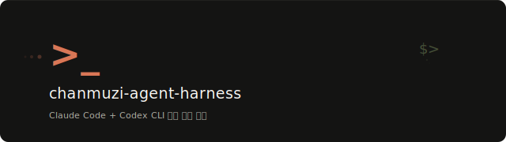

<p align="center">
  
</p>

<p align="center">
  
  
  
  
  
</p>

<p align="center">
  Claude Code와 Codex CLI 설정을 한 곳에서 관리하는 통합 harness
</p>

---

## 구조

```
chanmuzi-agent-harness/
├── shared/          # 크로스플랫폼 헬퍼, 쉘 함수, 공용 hooks
│   ├── lib/os.sh
│   ├── shell/init.sh
│   └── hooks/
├── claude/          # Claude Code 설정 (심링크 → ~/.claude/)
│   ├── CLAUDE.md
│   ├── settings.json
│   ├── hooks/
│   └── commands/
├── codex/           # Codex CLI 설정 (심링크 + patch → ~/.codex/)
│   ├── AGENTS.md
│   ├── profile.toml
│   ├── hooks.json
│   └── skills.txt
├── templates/       # 프로젝트별 템플릿
├── setup.sh         # 설치 스크립트
└── check.sh         # 설치 검증
```

## 빠른 시작

```bash
git clone git@github.com:chanmuzi/chanmuzi-agent-harness.git ~/chanmuzi-agent-harness
cd ~/chanmuzi-agent-harness
chmod +x setup.sh check.sh
./setup.sh        # Claude + Codex 모두 설치
./check.sh        # 설치 검증
```

> 클론 경로는 자유입니다. `setup.sh`가 `CHANMUZI_AGENT_HARNESS_HOME` 환경변수를 자동 등록합니다.
> 설치 후 쉘을 재시작하거나 `source ~/.zshrc`를 실행하세요.

### 선택적 설치

```bash
./setup.sh --claude       # Claude Code만
./setup.sh --codex        # Codex CLI만
./setup.sh --install-omx  # oh-my-codex CLI만 전역 설치
```

## 사전 요구사항

| 도구 | 최소 버전 | 설치 |
|------|-----------|------|
| Node.js | >= 18 | [nodejs.org](https://nodejs.org/) |
| Claude Code | latest | `npm install -g @anthropic-ai/claude-code` |
| Codex CLI | latest | `npm install -g @openai/codex` |
| jq | any | `brew install jq` / `apt install jq` |

`dev-browser`는 `setup.sh`가 자동으로 설치합니다.

## 쉘 명령어

### Claude Code

| 명령어 | 설명 |
|--------|------|
| `claude` | 권한 스킵 (hooks가 안전장치) |
| `claude-safe` | 기본 권한 모드 |
| `claude-team [name]` | tmux 세션에서 실행 |
| `claude-team-safe [name]` | tmux + 기본 권한 |

### Codex CLI

| 명령어 | 설명 |
|--------|------|
| `codex` | 승인/샌드박스 바이패스 (hooks가 안전장치) |
| `codex-safe` | 승인 있음 + 샌드박스 |

## 설정 관리 방식

| 도구 | 방식 | 이유 |
|------|------|------|
| Claude Code | 심링크 (전체 교체) | `settings.json`이 100% 공통 설정 |
| Codex CLI | 심링크 + config.toml patch | `config.toml`에 머신별 설정이 섞여 있음 |

## 보안 모델

이 harness는 기본적으로 Claude Code와 Codex CLI를 **퍼미션리스 모드**(권한 확인 없이 실행)로 설정합니다.
안전장치는 pre/post-tool-use **hooks**가 담당합니다 (예: `block-no-verify.sh`가 `--no-verify` 차단).

- `claude` / `codex` — 퍼미션리스 모드 (hooks가 안전장치)
- `claude-safe` / `codex-safe` — 매 동작마다 승인 필요

`setup.sh` 실행 전에 `claude/settings.json`과 `shared/shell/init.sh`를 확인하는 것을 권장합니다.

## 업데이트

```bash
cd ~/chanmuzi-agent-harness && git pull && ./setup.sh
```

---

<details>
<summary><b>oh-my-codex 정책</b></summary>

- 전역 `~/.codex`는 이 harness가 관리
- `oh-my-codex`는 `--scope project`로만 사용
- `omx setup --scope user`는 사용하지 않음

```bash
# 프로젝트별 적용
cd /path/to/project
omx setup --scope project

# 사전 점검
omx setup --scope project --dry-run
```

</details>

<details>
<summary><b>context7 복구</b></summary>

```bash
mkdir -p ~/.agents/skills/context7
scp ~/.agents/skills/context7/SKILL.md <user>@<host>:~/.agents/skills/context7/SKILL.md
./setup.sh --codex && ./check.sh
```

</details>

<details>
<summary><b>dev-browser 프로젝트별 활성화</b></summary>

dev-browser는 기본 비활성 상태입니다. 프로젝트에서 필요할 때:

**Claude Code** — 프로젝트 루트 `CLAUDE.md`에 추가:
```markdown
## Browser Automation
브라우저 자동화가 필요하면 `dev-browser` CLI를 사용하라.
```

**Codex CLI** — 별도 설정 불필요 (SKILL.md 자동 디스커버리)

</details>

<details>
<summary><b>OMC 플러그인 패치</b></summary>

| 스킬 | 패치 내용 | 이유 |
|------|-----------|------|
| `deep-interview` | ambiguity threshold `0.2` → `0.1` | 더 엄격한 모호성 기준 |

플러그인 업데이트 후 `./setup.sh --claude`를 다시 실행하면 패치가 자동 재적용됩니다.

</details>

<details>
<summary><b>플러그인 marketplace path 잔류 에러</b></summary>

**증상**: 세션 시작 시 `Marketplace file not found at .../<plugin-name>/Users/<username>/...` 형태의 경로 합성 에러 발생

**원인**: `claude plugin marketplace add <로컬경로>`로 등록 후 remote(`repo`)로 복원할 때, `settings.json`의 `extraKnownMarketplaces` 엔트리에서 `path` 필드가 제거되지 않고 `repo`와 공존. Claude Code 플러그인 시스템 버그.

**해결**:
1. `claude/settings.json`에서 해당 marketplace 엔트리의 `path` 필드를 수동 삭제
2. 세션 재시작 (`/reload-plugins`로는 불충분)
3. `./check.sh`로 잔류 여부 확인 가능

</details>
